# WordPress 更新マニュアル（Rinascente / YUMEHO）

**作成日**: 2026-04-13  
**対象**: サイト運用担当者 / 更新担当者  
**対象サイト**: Rinascente コーポレートサイト / YUMEHO 製品サイト  
**スクリーンショット**: 管理画面で撮影

このマニュアルは、現在の WordPress 管理画面で実際に更新できる箇所を、画面単位で細かく整理した運用用マニュアルです。  
特に重要なのは、**「固定ページを開けても、本文を編集しても見た目が変わらないページがある」** ことです。更新先を間違えないよう、まずは次の 3 点を先に確認してください。

1. YUMEHO の**会社概要**は、YUMEHO 側ではなく **Rinascente の「会社概要」** で更新します。
2. YUMEHO の**価格・見積 / シミュレーション**の元データは、YUMEHO 側ではなく **Rinascente の「製品マスター」** で更新します。
3. YUMEHO の**会員向け動画・資料・サポート情報**は、現在 **Rinascente 側の「会員サイト運用」** で一元管理します。

## 1. 更新場所の早見表

### 1.1 YUMEHO の主な更新箇所

| 更新したい内容 | 管理画面の場所 | 反映先 | 反映タイミング | 補足 |
|---|---|---|---|---|
| 導入事例 | `導入事例` | 導入事例一覧 / 詳細 / トップの事例訴求 | 通常は保存後すぐ | 一番よく使う更新画面 |
| FAQ本文 | `FAQ` | FAQページ / トップFAQ | 通常は保存後すぐ | 質問1件ごとに1投稿 |
| FAQページ導入文 | `固定ページ > FAQ` | FAQページ上部 | 通常は保存後すぐ | FAQ投稿とは別 |
| 導入拠点 | `導入拠点` | 全国マップ / 導入件数表示 | 通常は保存後すぐ | 住所から地図座標を生成 |
| 価格の確認 | `サイト更新 > 価格参照（Rinascente編集）` | 参照のみ | 参照のみ | 実際の編集は Rinascente 側 |
| 価格・見積・シミュレーションの元データ | `Rinascente > 製品マスター` | YUMEHO 価格 / 見積 / シミュレーション | 最大約15分 | YUMEHO側では編集しない |
| 会社概要の会社情報 | `Rinascente > 会社概要` | YUMEHO 会社概要ページ | 通常は保存後すぐ | YUMEHO 側固定ページ本文ではない |
| 画像・PDFなどのアップロード | `メディア` | 各投稿・固定ページで使用 | すぐ利用可能 | 画像差し替えの共通入口 |
| プライバシーポリシー | `固定ページ` | 該当ページ | 通常は保存後すぐ | 本文編集がそのまま反映 |
| 利用規約 | `固定ページ` | 該当ページ | 通常は保存後すぐ | 本文編集がそのまま反映 |
| 特定商取引法に基づく表記 | `固定ページ` | 該当ページ | 通常は保存後すぐ | 本文編集がそのまま反映 |

### 1.2 Rinascente の主な更新箇所

| 更新したい内容 | 管理画面の場所 | 反映先 | 反映タイミング | 補足 |
|---|---|---|---|---|
| ニュース | `ニュース` | Press / ニュース詳細 / トップ掲載 | 通常は保存後すぐ | Featured は1件のみ強調表示 |
| コラム | `コラム` | コラム一覧 / 詳細 | 通常は保存後すぐ | YUMEHO 連携設定あり |
| YUMEHOにも出すコラム | `コラム` の連携設定 | YUMEHO コラム一覧 / 詳細 | 最大約15分 | REST連携 + キャッシュあり |
| 会社情報 / サポート窓口 | `会社概要` | Rinascente 会社情報 / YUMEHO会社概要 | 通常は保存後すぐ | 両サイト共通の元データ |
| 製品マスター | `会員サイト運用 > 製品マスター` | YUMEHO価格 / 見積 / 契約テンプレート | 最大約15分 | 価格の元管理画面 |
| 契約・購入履歴 | `会員サイト運用 > 契約・購入履歴` | 会員ページの契約表示 | 通常は保存後すぐ | 会員別の履歴管理 |
| 会員限定動画 | `会員サイト運用 > 会員限定動画` | 会員ページ | 通常は保存後すぐ | YouTube URL / ID を登録 |
| 会員限定資料 | `会員サイト運用 > 会員限定資料` | 会員ページ | 通常は保存後すぐ | PDF等の配布資料 |
| サポート情報 | `会員サイト運用 > サポート情報` | 会員ページ | 通常は保存後すぐ | お知らせ・重要情報 |
| プライバシーポリシー | `固定ページ` | 該当ページ | 通常は保存後すぐ | 本文編集がそのまま反映 |
| 利用規約 | `固定ページ` | 該当ページ | 通常は保存後すぐ | 本文編集がそのまま反映 |
| アナリティクス / 連携URL | `外観 > カスタマイズ` | サイト全体 | 保存後すぐ | 管理者向けの全体設定 |

### 1.3 CMS で更新できない / 現在停止中の項目

| 項目 | 状態 | 対応方法 |
|---|---|---|
| YUMEHO 製品紹介ページ本文 | テンプレート固定 | 開発者へ依頼 |
| YUMEHO 導入の流れページ | テンプレート固定 | 開発者へ依頼 |
| YUMEHO 補助金ガイドの構造変更 | テンプレート固定 | 開発者へ依頼 |
| YUMEHO お問い合わせページの構造変更 | テンプレート固定 | 開発者へ依頼 |
| Rinascente Corporate Identity の構造変更 | テンプレート固定 | 開発者へ依頼 |
| Rinascente お問い合わせページの構造変更 | テンプレート固定 | 開発者へ依頼 |
| Rinascente 導入事例ページ | 現在の管理画面更新対象外 | 開発者へ依頼 |

## 2. 公開ページごとの更新元マップ

### 2.1 YUMEHO 側の公開ページ

| 公開ページ | CMSで更新できるか | 実際の更新元 | 補足 |
|---|---|---|---|
| トップページ | 一部可 | 導入事例 / FAQ / 導入拠点 / Rinascente 製品マスター | ページ本文ではなく各機能の内容が反映 |
| 製品紹介 | 基本不可 | テンプレート | 文言や構造変更は開発対応 |
| 導入シミュレーション | 一部可 | Rinascente 製品マスター | 商品・価格ロジックは製品マスター参照 |
| 導入の流れ | 基本不可 | テンプレート | CMS本文編集では運用しない |
| 価格・見積 | 一部可 | Rinascente 製品マスター | 価格の元データは Rinascente 側 |
| 補助金ガイド | 基本不可 | テンプレート | 構造変更は開発対応 |
| FAQ | 可 | `FAQ` 投稿 + `固定ページ > FAQ` | 投稿が質問一覧、本体ページは導入文 |
| 会社概要 | 可 | `Rinascente > 会社概要` | YUMEHO 側の固定ページ本文ではない |
| お問い合わせ | 基本不可 | テンプレート / フォーム設定 | 構造変更は開発対応 |
| プライバシーポリシー | 可 | `固定ページ > プライバシーポリシー` | 本文編集が反映 |
| 利用規約 | 可 | `固定ページ > 利用規約` | 本文編集が反映 |
| 特定商取引法に基づく表記 | 可 | `固定ページ > 特定商取引法に基づく表記` | 本文編集が反映 |
| Member Login / Member Area / Forgot / Reset / 決済完了 / 決済キャンセル | 原則触らない | システムページ | 通常運用では編集しない |

### 2.2 Rinascente 側の公開ページ

| 公開ページ | CMSで更新できるか | 実際の更新元 | 補足 |
|---|---|---|---|
| トップページ | 一部可 | ニュース / コラム | 主要構造はテンプレート固定 |
| Corporate Identity | 一部可 | 会社概要 | 会社データはCMS更新可、構造変更は開発対応 |
| 導入事例 | 現在不可 | 開発対応 | 現構成では管理画面更新対象外 |
| Press | 可 | ニュース | 一覧・詳細ともニュース投稿から更新 |
| お問い合わせ | 基本不可 | テンプレート / フォーム設定 | 構造変更は開発対応 |
| プライバシーポリシー | 可 | `固定ページ > プライバシーポリシー` | 本文編集が反映 |
| 利用規約 | 可 | `固定ページ > 利用規約` | 本文編集が反映 |
| Member Login / Member Page / Forgot / Reset | 原則触らない | システムページ | 通常運用では編集しない |

## 3. ログイン方法

### 3.1 ログイン画面の見方

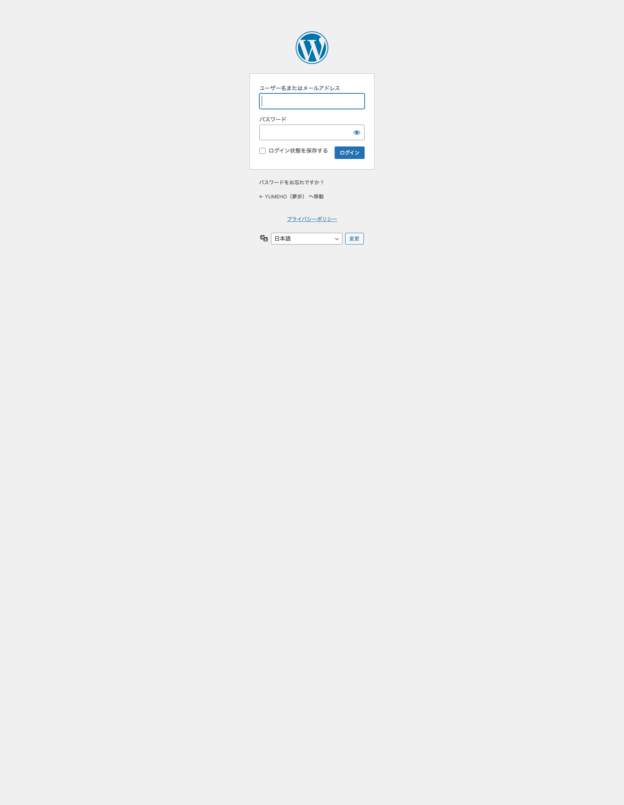

1. dev環境では、まず各サイトの `/wp-admin/` を開きます。
2. 公開までは dev環境にベーシック認証がかかっているため、ブラウザの認証ダイアログが出たら共有の ID / PW を入力します。
3. `ユーザー名またはメールアドレス` と `パスワード` を入力します。
4. `ログイン` を押します。
5. 本番環境で 2段階認証が有効な場合は、認証コード入力まで進みます。

### 3.2 URL の考え方

| 環境 | Rinascente | YUMEHO | 補足 |
|---|---|---|---|
| dev環境（確認用） | `https://corp-dev.rinascenteyumeho.jp/wp-admin/` | `https://dev.rinascenteyumeho.jp/wp-admin/` | 公開まではベーシック認証あり |
| 本番環境ではこちら | `https://onerinascente.co.jp/wp-admin/` | `https://rinascenteyumeho.jp/wp-admin/` | 公開後に使用 |

dev環境は公開までベーシック認証で保護されています。WordPress のログイン画面が出る前に、共有のベーシック認証 ID / PW の入力が必要です。

## 4. YUMEHO の更新手順

### 4.1 サイト更新ダッシュボード

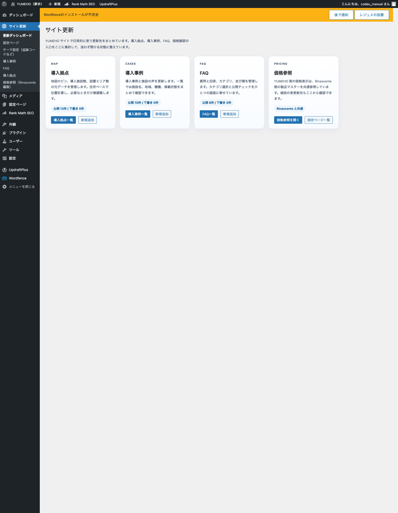

この画面は、YUMEHO の更新導線をまとめた入口です。迷ったらまずここを開いてください。

1. 左メニューの `サイト更新` を開きます。
2. 画面上部のカードから、更新したい内容を選びます。
3. 次の使い分けを基準にします。

| カード / 導線 | 使うとき |
|---|---|
| 導入事例 | 導入施設の事例を追加・修正したい |
| FAQ | よくある質問を追加・修正したい |
| 導入拠点 | 地図や導入件数の元データを更新したい |
| 固定ページ | 規約や法務ページ、FAQ導入文を変えたい |
| テーマ設定 | サイト全体の設定を変えたい |
| 価格参照 | 価格を確認したいが、編集は Rinascente 側で行う |

### 4.2 導入事例の更新

#### 一覧画面

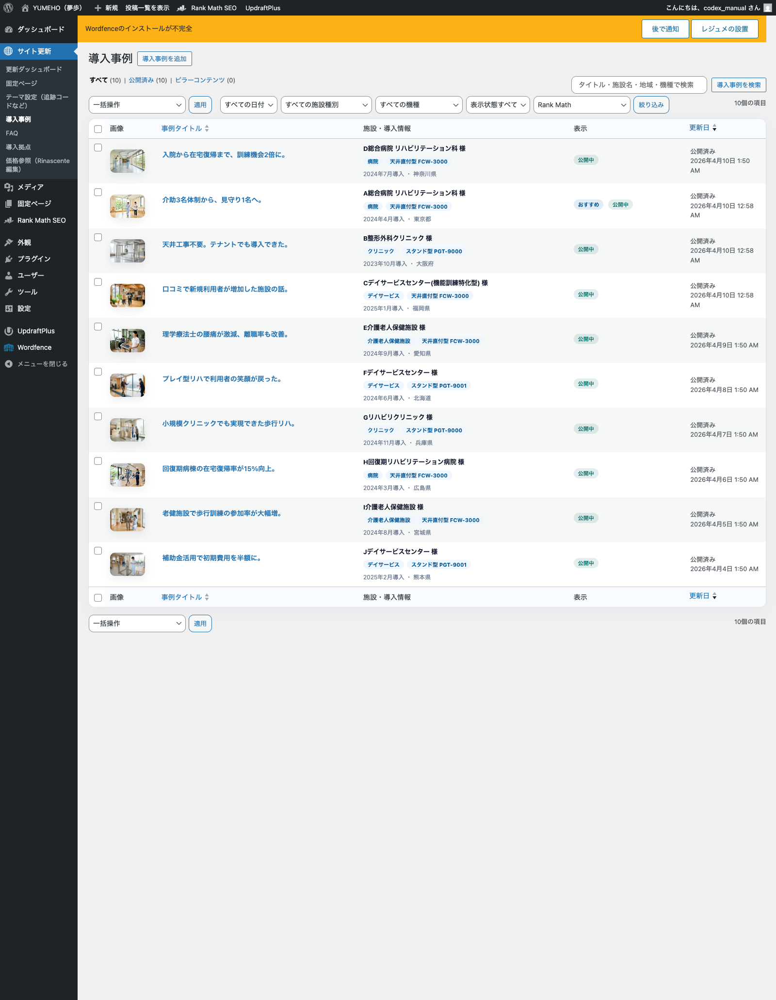

1. 左メニューの `導入事例` を開きます。
2. 既存記事を直す場合はタイトルをクリックします。
3. 新規追加は `新規追加` を押します。
4. 一覧では主に次を確認します。

| 確認項目 | 見るポイント |
|---|---|
| サムネイル | メイン画像が入っているか |
| タイトル | 施設名・機種が分かるか |
| 概要 | 施設種別や機種が想定どおりか |
| フラグ | `おすすめ` や `一覧非表示` の有無 |

#### 編集画面

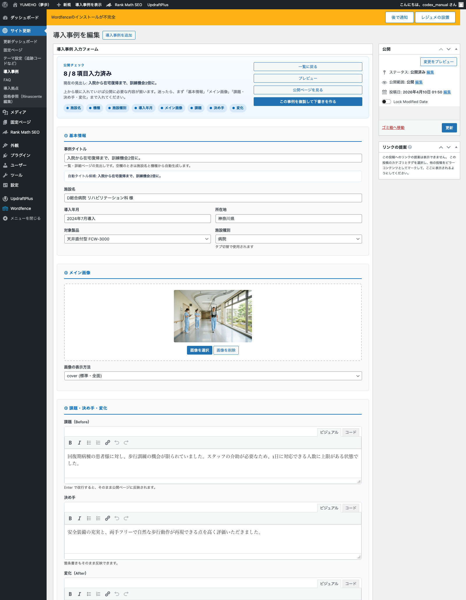

1. `① 基本情報` を入力します。
2. `② メイン画像` で代表画像を設定します。
3. `③ 課題・決め手・変化` を入力します。
4. 必要なら `④ 数値で見る変化`、`⑤ 経緯・お客様の声`、`⑥ 表示設定` を入力します。
5. 右上の `公開` または `更新` を押します。

#### 入力項目の意味

| セクション | 項目 | 使い方 |
|---|---|---|
| ① 基本情報 | 事例タイトル | 空欄でも可。未入力なら施設名と機種から自動生成 |
| ① 基本情報 | 施設名 | 一覧・詳細の主表示 |
| ① 基本情報 | 導入年月 | 例: `2025年4月導入` |
| ① 基本情報 | 所在地 | 例: `東京都` |
| ① 基本情報 | 対象製品 | 機種名を選択 |
| ① 基本情報 | 施設種別 | タブ切替や分類に使用 |
| ② メイン画像 | 画像を選択 | 一覧サムネイルと詳細の代表画像 |
| ② メイン画像 | 画像の表示方法 | `cover` / `contain` を選択 |
| ③ 課題・決め手・変化 | 課題 / 決め手 / 変化 | 公開ページの本文にそのまま反映 |
| ④ 数値で見る変化 | ラベル / 値 | 成果を3件まで表示可能 |
| ⑤ 経緯・お客様の声 | 導入決定までの経緯 / お客様の声 / 発言者 | 詳細ページの補足情報 |
| ⑥ 表示設定 | おすすめ事例として出す | トップなど優先表示 |
| ⑥ 表示設定 | 一覧には出さない | 詳細URLを残しつつ一覧から除外 |

#### 更新時の判断基準

1. まず最低限、`施設名` `対象製品` `施設種別` `導入年月` `メイン画像` `課題` `決め手` `変化` を埋めます。
2. 画像だけ差し替えたい場合も、本文を消さずに `② メイン画像` だけ更新して問題ありません。
3. 類似事例を増やすときは `この事例を複製して下書きを作る` を使うと早いです。

### 4.3 FAQ の更新

#### 一覧画面

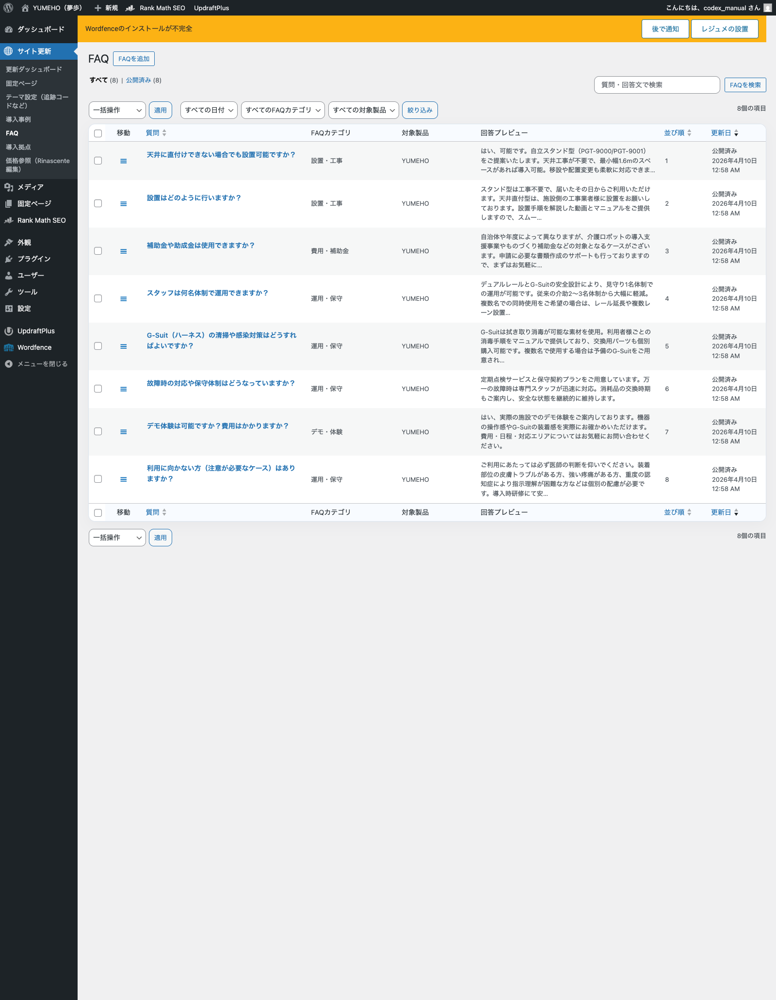

1. 左メニューの `FAQ` を開きます。
2. 既存FAQの修正はタイトルをクリックします。
3. 新しいFAQは `新規追加` を押します。
4. 一覧で `FAQカテゴリ`、`対象製品`、`回答要約`、`並び順` を確認します。

#### 編集画面

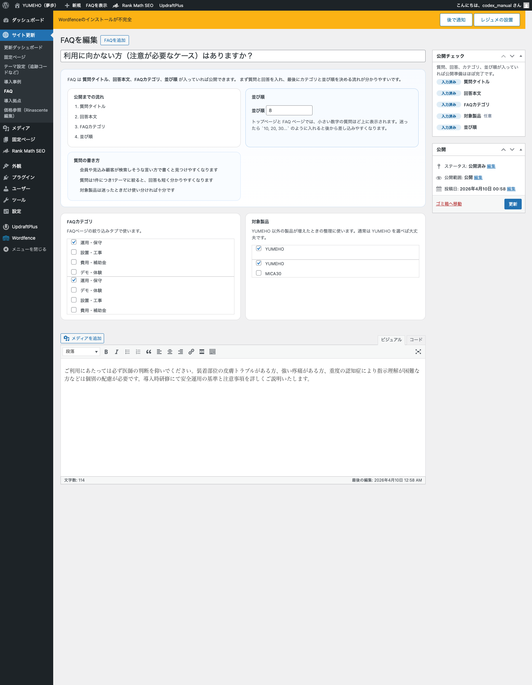

1. 画面上部のタイトル欄に `質問タイトル` を入れます。
2. 本文エリアに `回答本文` を入れます。
3. 上部のカードで `FAQカテゴリ` を選びます。
4. 必要に応じて `対象製品` を選びます。
5. `並び順` を設定します。
6. 右上の `公開` または `更新` を押します。

#### FAQ の基本ルール

| 項目 | ルール |
|---|---|
| 質問タイトル | 1投稿につき1質問 |
| 回答本文 | そのまま公開ページの回答欄に出る |
| FAQカテゴリ | FAQページの絞り込みタブに使う |
| 対象製品 | 通常は YUMEHO を選べば問題なし |
| 並び順 | 小さい数字ほど上に表示 |

#### 並び順のコツ

1. 最初は `10, 20, 30...` のように登録します。
2. あとから間に差し込みたいときは `15` などを入れます。
3. 一覧画面で順序調整できる場合もありますが、迷ったら編集画面の `並び順` を基準にしてください。

### 4.4 導入拠点の更新

#### 一覧画面

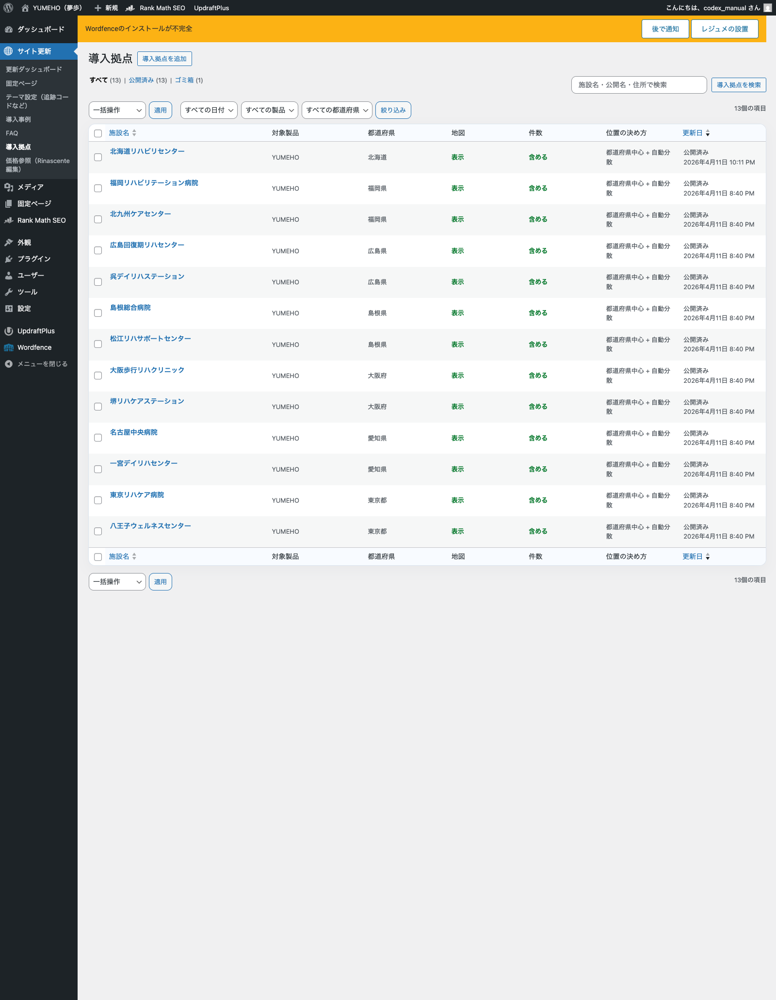

1. 左メニューの `導入拠点` を開きます。
2. 施設ごとに1件登録されていることを確認します。
3. 既存の修正はタイトルをクリックします。
4. 新規追加は `新規追加` を押します。

#### 編集画面

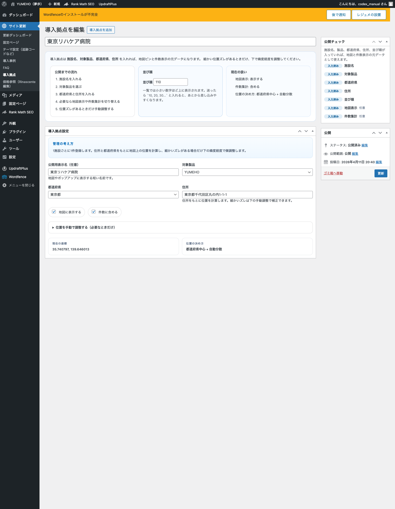

1. タイトル欄に `施設名` を入れます。
2. `対象製品` を選びます。
3. `都道府県` と `住所` を入力します。
4. `並び順` を設定します。
5. `地図に表示する` と `件数に含める` を必要に応じて切り替えます。
6. 地図位置がずれる場合だけ `位置を手動で調整する` を開き、緯度経度を入力します。
7. `公開` または `更新` を押します。

#### 入力ルール

| 項目 | 必須 | 説明 |
|---|---|---|
| 施設名 | 必須 | 投稿タイトルに入力 |
| 対象製品 | 必須 | 地図の製品別集計に使う |
| 都道府県 | 必須 | 位置計算の基準 |
| 住所 | 必須 | 位置計算の基準 |
| 並び順 | 必須 | 一覧表示順 |
| 公開用表示名 | 任意 | 地図に短い名称で出したいとき |
| 地図に表示する | 任意 | オフでマップ非表示 |
| 件数に含める | 任意 | オフで件数カウント対象外 |
| 緯度 / 経度 | 任意 | 自動位置がずれたときだけ使う |

### 4.5 価格参照画面の使い方

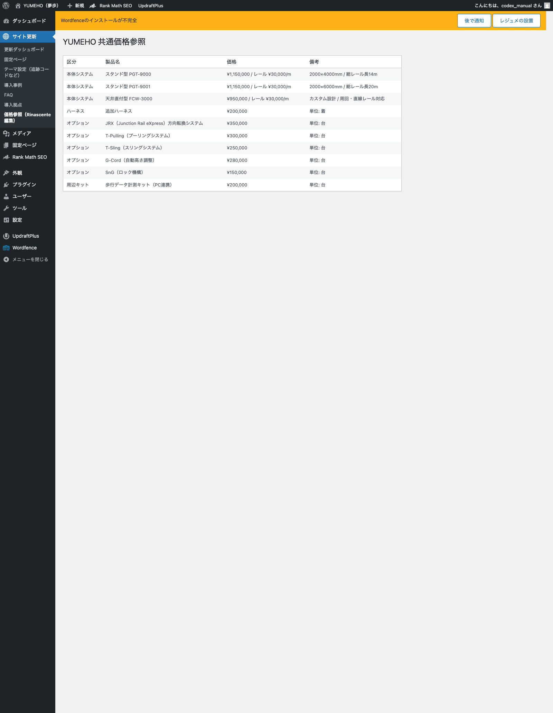

この画面は**確認用**です。YUMEHO 側で価格を直接編集する画面ではありません。

1. `サイト更新 > 価格参照（Rinascente編集）` を開きます。
2. 現在の本体価格・オプション価格を確認します。
3. 実際に修正したい場合は、画面内の `Rinascente の製品マスターを開く` を押します。
4. 詳細な編集方法は、このマニュアルの `5.6 製品マスターの更新` を参照します。

#### 反映の考え方

| 更新したいもの | 実際の編集先 |
|---|---|
| YUMEHO の価格表 | Rinascente の `製品マスター` |
| YUMEHO の見積シミュレーション | Rinascente の `製品マスター` |
| 契約情報のひな形 | Rinascente の `製品マスター` |

### 4.6 メディアの更新

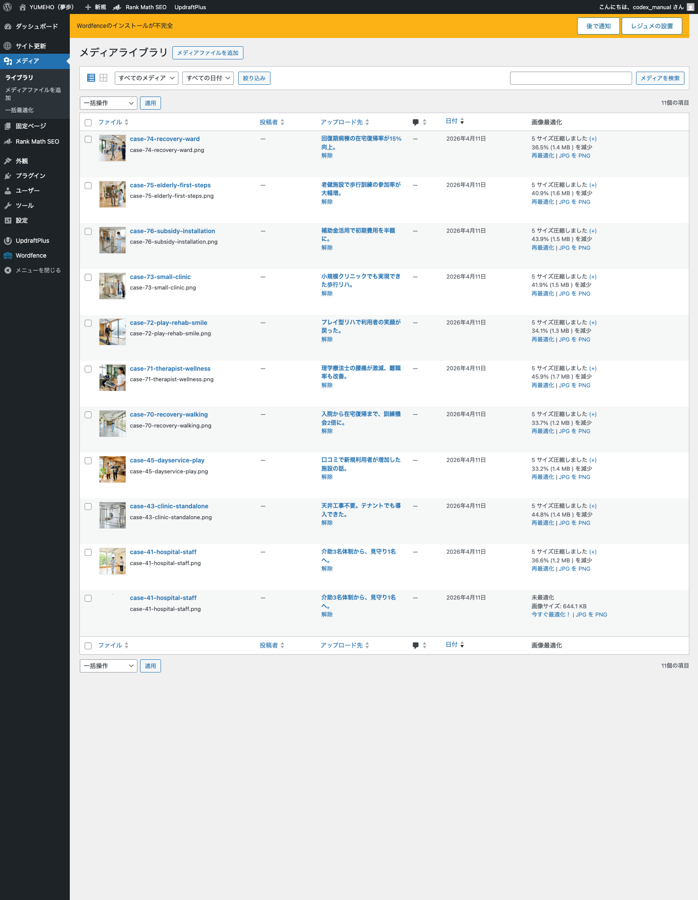

画像・PDF・資料ファイルをアップロードする共通画面です。操作は Rinascente 側でもほぼ同じです。

1. 左メニューの `メディア` を開きます。
2. `新規メディアファイルを追加` でファイルをアップロードします。
3. 既存ファイルを差し替えたい場合は、関連する投稿編集画面から再選択する運用を推奨します。
4. 画像を使う更新では、以下を目安にします。

| 用途 | 推奨 |
|---|---|
| 導入事例の代表画像 | 横長・明るめ・施設や製品が分かるもの |
| ニュース / コラムの代表画像 | 横長・一覧で内容が伝わるもの |
| PDF資料 | ファイル名を分かりやすくする |

### 4.7 固定ページの更新

#### 一覧画面

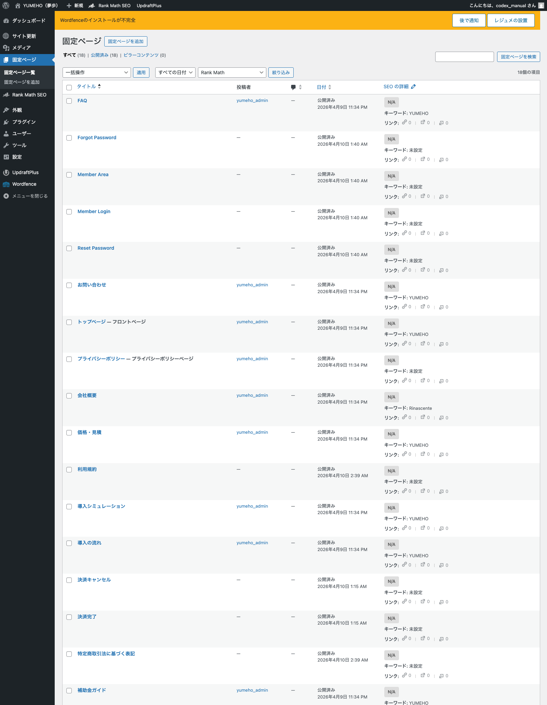

固定ページは**全部が本文更新対象ではありません**。次の表で使い分けてください。

| 固定ページ | 本文編集が反映されるか | 更新方法 |
|---|---|---|
| FAQ | 一部反映 | ページ上部導入文は本文、質問一覧は `FAQ` 投稿で更新 |
| プライバシーポリシー | 反映される | 本文を編集 |
| 利用規約 | 反映される | 本文を編集 |
| 特定商取引法に基づく表記 | 反映される | 本文を編集 |
| 会社概要 | 基本反映しない | `Rinascente > 会社概要` を更新 |
| トップページ / 製品紹介 / 導入の流れ / 価格・見積 / 補助金ガイド / お問い合わせ | 基本反映しない | テンプレートまたは別機能を更新 |

#### 法務ページ編集

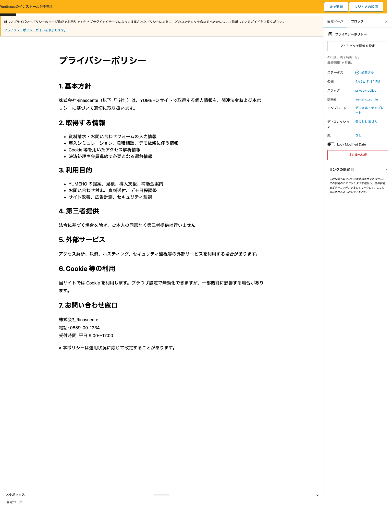

1. `固定ページ` から対象ページを開きます。
2. 本文ブロック内の文章を更新します。
3. 見出しや箇条書きはブロックエディタで整えます。
4. `更新` を押します。

#### YUMEHO 会社概要の注意

YUMEHO の `会社概要` ページに表示される会社情報は、現在 **Rinascente の「会社概要」** を参照しています。  
YUMEHO 側の固定ページ本文を直しても、会社名・住所・電話番号などの主要情報はここでは運用しません。

## 5. Rinascente の更新手順

### 5.1 サイト更新ダッシュボード

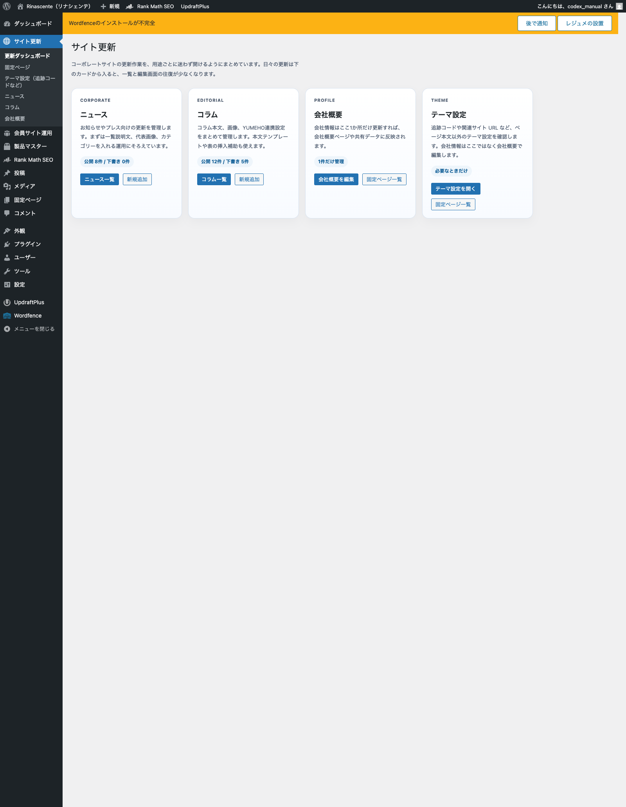

1. 左メニューの `サイト更新` を開きます。
2. 画面上部の導線から、更新先の画面へ移動します。
3. 日常的によく使うのは次の 4 つです。

| 導線 | 使うとき |
|---|---|
| ニュース | Press 更新 |
| コラム | コラム公開 |
| 会社概要 | 会社情報 / 問い合わせ先 / YUMEHO 会社情報更新 |
| 会員サイト運用 | 製品マスター / 契約 / 会員向けコンテンツ更新 |

### 5.2 ニュースの更新

#### 一覧画面

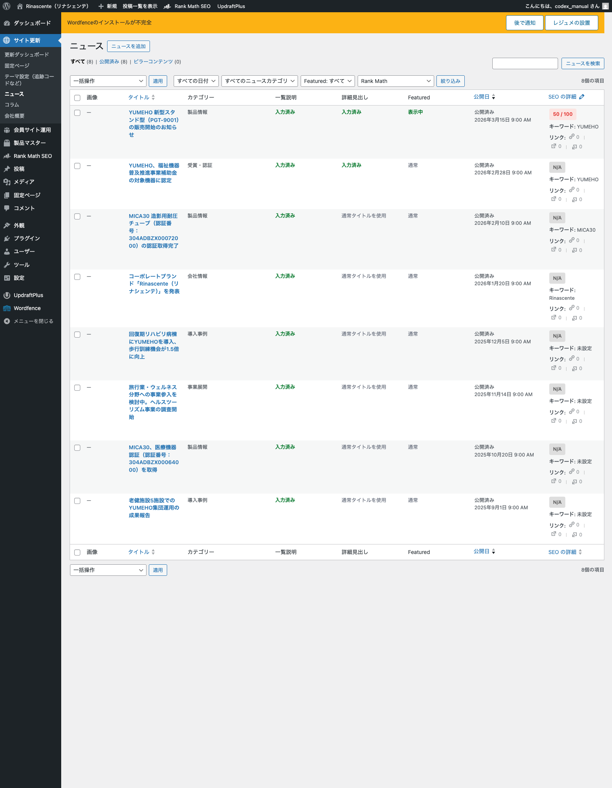

1. 左メニューの `ニュース` を開きます。
2. 修正は既存タイトルをクリックします。
3. 新規は `新規追加` を押します。
4. 一覧では次の列を確認します。

| 列 | 意味 |
|---|---|
| サムネイル | 代表画像の有無 |
| カテゴリー | ニュース分類 |
| 抜粋 | 一覧説明文の有無 |
| 表示タイトル | 詳細ページ専用タイトルの有無 |
| Featured | Press 先頭で強調表示されるか |

#### 編集画面

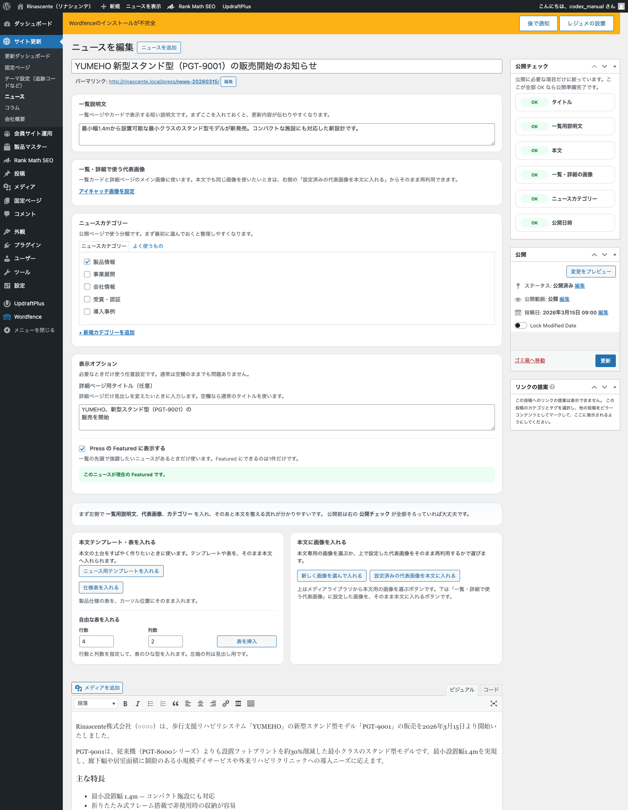

1. タイトルを入力します。
2. 本文を入力します。
3. `一覧説明文` を入力します。
4. `一覧・詳細で使う代表画像` を設定します。
5. `ニュースカテゴリー` を選びます。
6. 必要に応じて `詳細ページ用タイトル` を入れます。
7. Press の先頭で強調したい場合だけ `Press の Featured に表示する` をオンにします。
8. `公開` または `更新` を押します。

#### ニュース更新時のルール

| 項目 | ルール |
|---|---|
| タイトル | 一覧と詳細の基本タイトル |
| 一覧説明文 | Press 一覧カードで使う短文 |
| 本文 | 詳細ページ本文 |
| 代表画像 | 一覧カードと詳細のメイン画像 |
| 詳細ページ用タイトル | 任意。詳細だけ見出しを変えたいとき |
| Featured | 1件だけ。次をONにすると前のFeaturedは外れる |

### 5.3 コラムの更新

#### 一覧画面

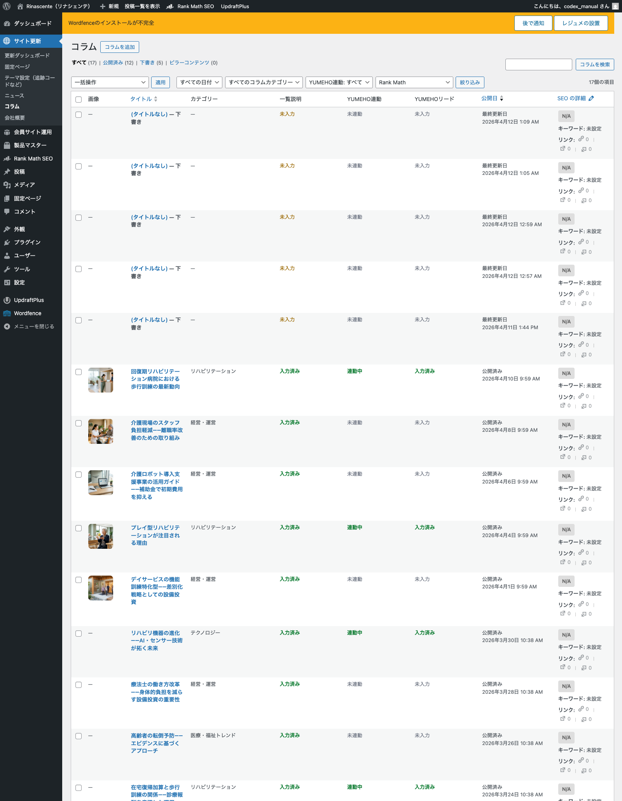

1. 左メニューの `コラム` を開きます。
2. 既存コラムを修正する場合はタイトルをクリックします。
3. 新規作成は `新規追加` を押します。
4. 一覧では `YUMEHO連動` と `YUMEHOリード` を特に確認します。

#### 編集画面

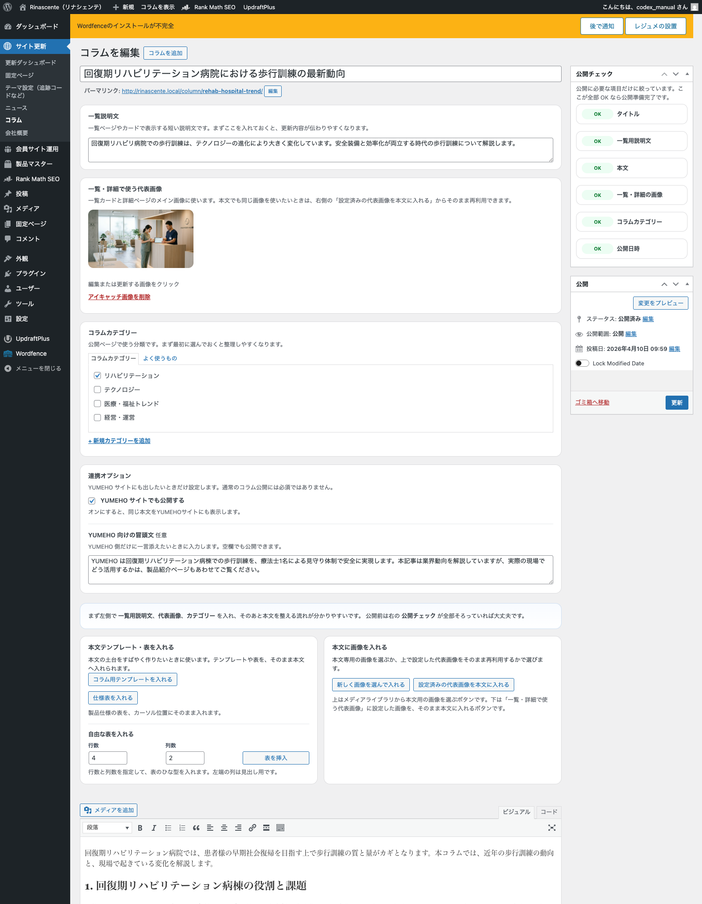

1. タイトルを入力します。
2. 本文を入力します。
3. `一覧説明文` を入力します。
4. `代表画像` を設定します。
5. `コラムカテゴリー` を選びます。
6. YUMEHO にも出したい場合だけ `YUMEHO サイトでも公開する` をオンにします。
7. 必要なら `YUMEHO 向けの冒頭文` を入れます。
8. `公開` または `更新` を押します。

#### YUMEHO 連携の考え方

| 項目 | 説明 |
|---|---|
| YUMEHO サイトでも公開する | ON にすると YUMEHO 側でも同じ本文を表示 |
| YUMEHO 向けの冒頭文 | YUMEHO 側だけで見せる補足文 |
| 反映タイミング | 最大約15分 |
| 使いどころ | YUMEHO 利用者にも読ませたい製品寄りのコラム |

### 5.4 会社概要の更新

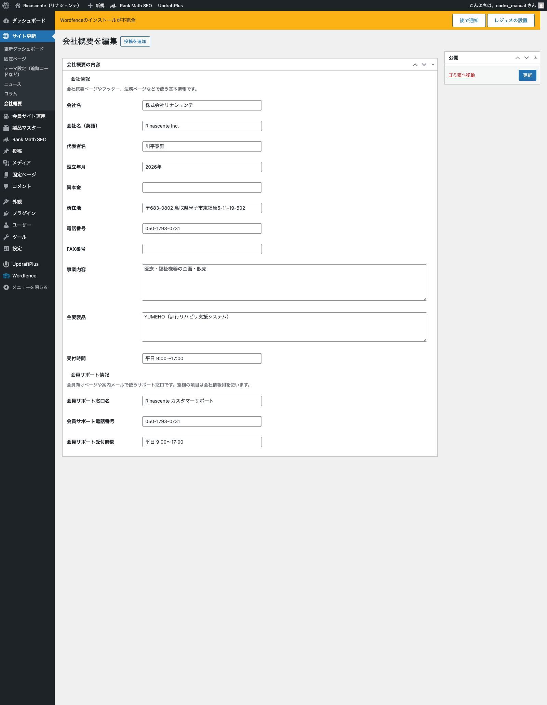

この画面は、**Rinascente 自社情報の更新画面**であると同時に、**YUMEHO 会社概要の元データ**でもあります。

1. 左メニューの `会社概要` を開きます。
2. 会社情報欄を更新します。
3. サポート窓口欄を更新します。
4. `更新` を押します。

#### 更新できる主な項目

| 区分 | 項目 |
|---|---|
| 会社情報 | 会社名 |
| 会社情報 | 会社名（英語） |
| 会社情報 | 代表者名 |
| 会社情報 | 設立年月 |
| 会社情報 | 資本金 |
| 会社情報 | 所在地 |
| 会社情報 | 電話番号 |
| 会社情報 | FAX番号 |
| 会社情報 | 事業内容 |
| 会社情報 | 主要製品 |
| 会社情報 | 受付時間 |
| サポート | 会員サポート窓口名 |
| サポート | 会員サポート電話番号 |
| サポート | 会員サポート受付時間 |

#### 更新前に確認すること

1. 会社名や所在地を変える場合は、法務ページや登記情報との整合性を先に確認します。
2. 電話番号や受付時間の変更は、YUMEHO 側の会社概要にも反映される前提で更新します。
3. ページ本文ではなく専用入力欄が正しい更新元です。

### 5.5 会員サイト運用ダッシュボード

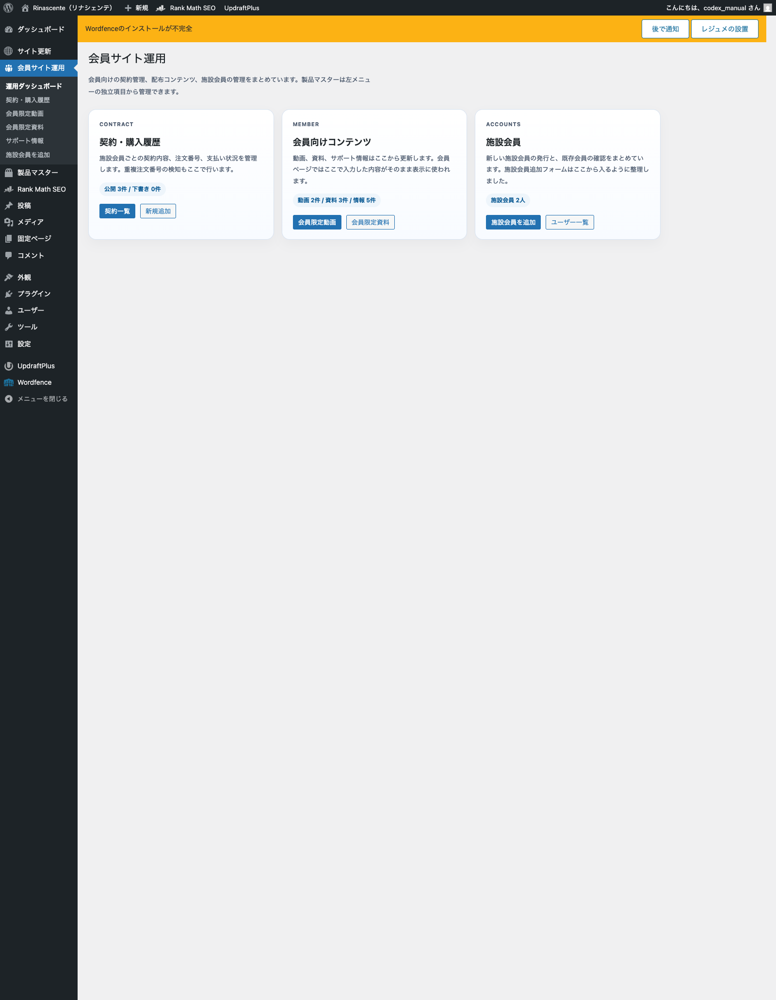

会員関連の更新は、この画面を起点にすると迷いません。

1. 左メニューの `会員サイト運用` を開きます。
2. 目的に応じて次を使い分けます。

| 画面 | 使うとき |
|---|---|
| 製品マスター | 商品名・価格・選択肢・契約ひな形を更新したい |
| 契約・購入履歴 | 会員別の購入履歴や契約状況を更新したい |
| 会員限定動画 | 会員向けの動画を追加したい |
| 会員限定資料 | 会員向けのPDFや資料を追加したい |
| サポート情報 | 会員向けのお知らせを出したい |

### 5.6 製品マスターの更新

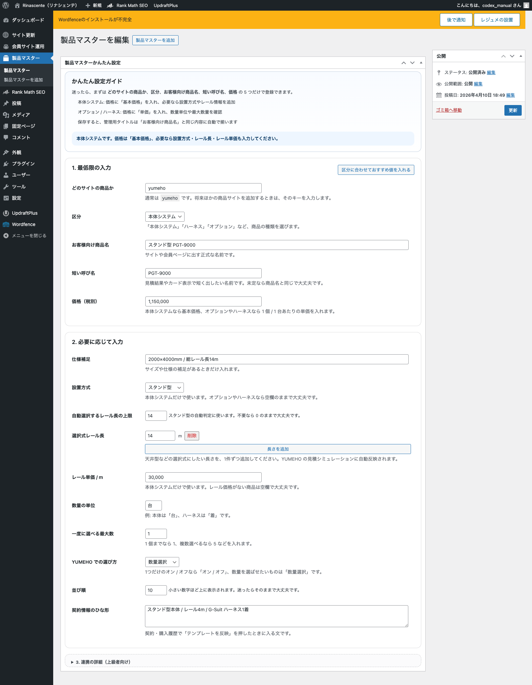

この画面は、YUMEHO の価格・見積・契約情報の**元マスター**です。価格変更時はここを更新します。

1. `会員サイト運用 > 製品マスター` を開きます。
2. 既存製品を修正するか、新規追加します。
3. 最低限 `どのサイトの商品か` `区分` `お客様向け商品名` `短い呼び名` `価格（税別）` を入力します。
4. 必要に応じて設置方式やレール長、単位、最大数量を設定します。
5. 契約書や会員表示で使う文面がある場合は `契約情報のひな形` を入れます。
6. `公開` または `更新` を押します。

#### 主な入力項目

| セクション | 項目 | 使い方 |
|---|---|---|
| 最低限の入力 | どのサイトの商品か | 通常は `yumeho` |
| 最低限の入力 | 区分 | 本体システム / ハーネス / オプション等 |
| 最低限の入力 | お客様向け商品名 | サイト表示の正式名 |
| 最低限の入力 | 短い呼び名 | 見積やカードの短縮表示 |
| 最低限の入力 | 価格（税別） | 本体の基本価格または単価 |
| 必要に応じて入力 | 仕様補足 | サイズ・構成の補足 |
| 必要に応じて入力 | 設置方式 | 本体システム向け |
| 必要に応じて入力 | 自動選択するレール長の上限 | スタンド型判定等で使用 |
| 必要に応じて入力 | 選択式レール長 | 天井型などの長さ候補 |
| 必要に応じて入力 | レール単価 / m | レール課金時に使用 |
| 必要に応じて入力 | 数量の単位 | 台 / 着 / 個 など |
| 必要に応じて入力 | 一度に選べる最大数 | 1件の見積で選択できる数 |
| 必要に応じて入力 | YUMEHOでの選び方 | オン/オフ or 数量選択 |
| 必要に応じて入力 | 並び順 | 表示順 |
| 必要に応じて入力 | 契約情報のひな形 | 契約画面へ流し込む文面 |
| 上級者向け | 商品コード | 内部連携用の安定コード |
| 上級者向け | 価格連携キー | YUMEHO価格計算の内部キー |
| 上級者向け | 参照元メモ | 元資料のメモ |

#### 反映先

| 変更内容 | 反映先 |
|---|---|
| 商品名 / 短縮名 | YUMEHO の価格・見積表示 |
| 価格 | YUMEHO の価格表 / 見積 / シミュレーション |
| 契約情報のひな形 | 契約・購入履歴のテンプレート反映 |
| レール長 / 数量設定 | YUMEHO の選択UI |

### 5.7 契約・購入履歴の更新

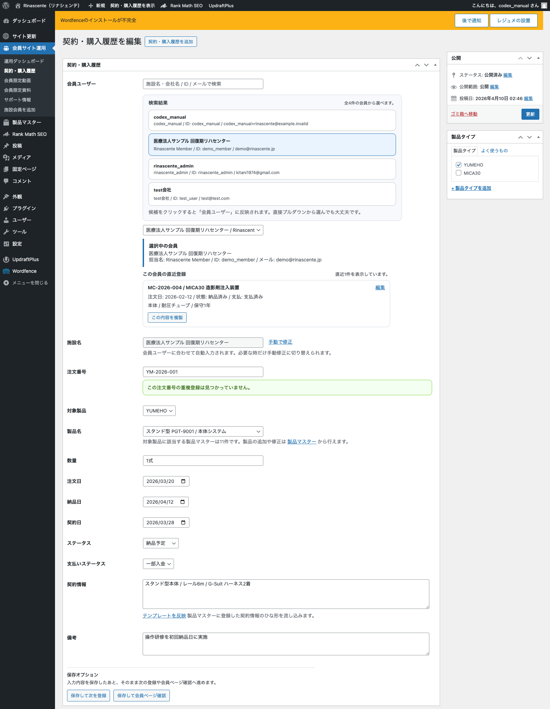

会員ページに表示する契約情報や購入履歴の管理画面です。

1. `会員サイト運用 > 契約・購入履歴` を開きます。
2. 対象の会員を検索して選びます。
3. `施設名` `注文番号` `対象製品` `製品名` `数量` を確認または入力します。
4. `注文日` `納品日` `契約日` を入れます。
5. `ステータス` と `支払いステータス` を設定します。
6. 必要に応じて `契約情報` と `備考` を入れます。
7. `更新` を押します。

#### 入力の考え方

| 項目 | 説明 |
|---|---|
| 会員ユーザー | まずここを選ぶ。施設名が自動補完される |
| 施設名 | 通常は自動入力、必要時のみ手動修正 |
| 対象製品 | 製品グループ |
| 製品名 | 製品マスターから選択 |
| 契約情報 | 製品マスターのひな形を反映可能 |
| 備考 | 個別事情や運用メモ |

### 5.8 会員限定動画の更新

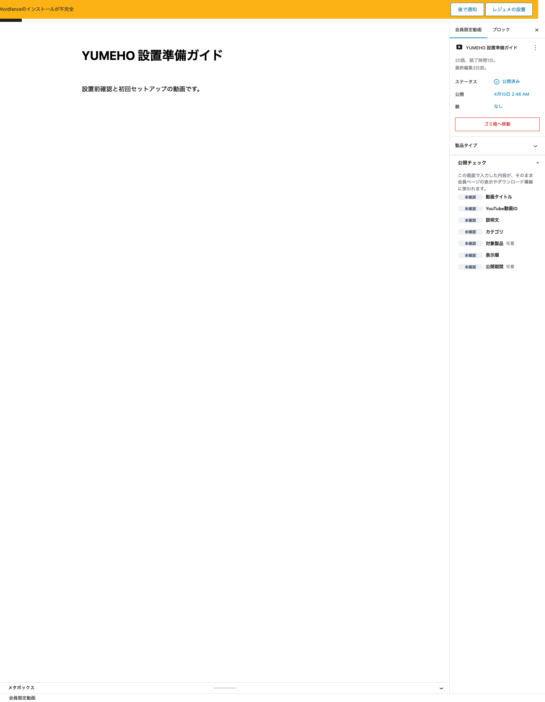

この画面は縦長で、スクリーンショットより下にも入力欄が続きます。実際の更新では、上から順に `動画情報` `表示設定` `公開期間` を埋めていきます。

1. `会員サイト運用 > 会員限定動画` を開きます。
2. タイトルを入力します。
3. `YouTube URL または 動画ID` を入力します。
4. `説明文` を入力します。
5. `カテゴリ` と `対象製品` を設定します。
6. 必要なら `公開開始日` と `公開終了日` を設定します。
7. 上部の `表示順` を調整します。
8. `公開` または `更新` を押します。

#### 重要なルール

| 項目 | ルール |
|---|---|
| YouTube入力 | 共有URLを貼っても可。保存時に動画IDへ整形 |
| 説明文 | 会員ページの一覧と詳細で使用 |
| 本文欄 | 現在の会員ページでは使わない |
| 表示順 | 小さい数字ほど上に表示 |
| 対象製品 | 空欄なら共通表示 |

### 5.9 会員限定資料の更新

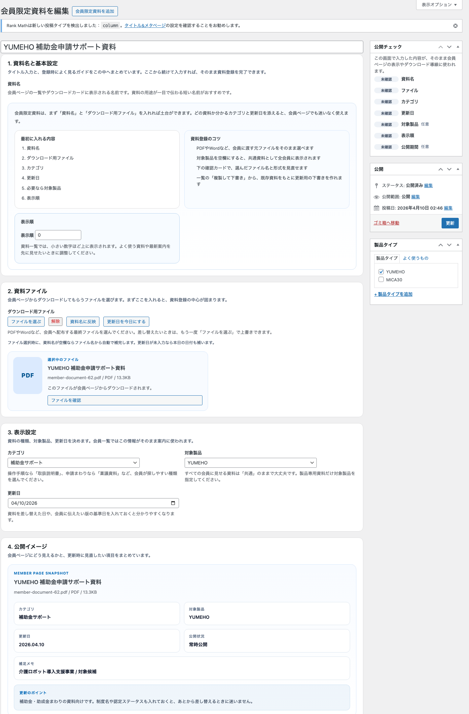

現在は、右下の矢印で切り替える方式ではなく、`資料名と基本設定` から `公開期間` までを1画面で上から続けて入力します。タイトル欄も同じ流れの中に表示されます。

1. `会員サイト運用 > 会員限定資料` を開きます。
2. `1. 資料名と基本設定` で資料名を入力し、必要なら `表示順` を調整します。
3. `2. 資料ファイル` で `ファイルを選ぶ` から PDF や Word を登録します。
4. 資料名が未入力ならファイル選択時に自動補完されます。必要なら `資料名に反映` と `更新日を今日にする` を使います。
5. `3. 表示設定` で `カテゴリ`、`対象製品`、`更新日` を設定します。
6. `4. 公開イメージ` で会員ページでの見え方を確認します。
7. 補助金関連の資料だけ `5. 制度・補助金メモ` に `制度名` と `認定ステータス` を入れます。
8. 必要なら `6. 公開期間` で `公開開始日` と `公開終了日` を設定します。
9. `公開` または `更新` を押します。

#### 重要なルール

| 項目 | ルール |
|---|---|
| ファイル | 会員に配布する最終版を登録 |
| 更新日 | 差し替え日や版の基準日を入れる |
| 対象製品 | 空欄なら共通資料 |
| 画面構成 | タイトル欄と資料設定は同じ画面で続けて入力する |
| 本文欄 | 現在の会員ページでは使わない |
| 表示順 | 小さい数字ほど上に表示 |

### 5.10 サポート情報の更新

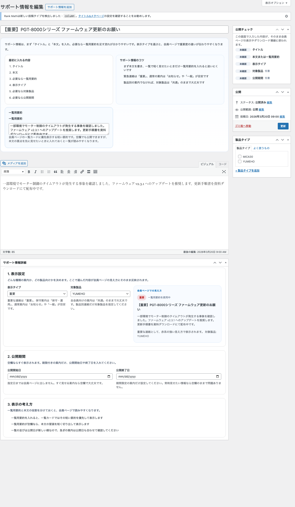

サポート情報は、タイトルと本文に加えて、見え方を決める `表示タイプ` が重要です。

1. `会員サイト運用 > サポート情報` を開きます。
2. タイトルを入力します。
3. 本文を入力します。
4. 必要なら `一覧用要約` を入れます。
5. `表示タイプ` と `対象製品` を選びます。
6. 必要なら `公開開始日` と `公開終了日` を設定します。
7. `公開` または `更新` を押します。

#### 重要なルール

| 項目 | ルール |
|---|---|
| 本文 | 会員ページ詳細の本文 |
| 一覧用要約 | 一覧カードに優先表示する短文 |
| 表示タイプ | `重要` `保守・運用` `お知らせ` `一般` など、見え方を決める |
| 並び順 | 手動順ではなく公開日時の新しい順が基本 |

### 5.11 固定ページの更新

#### 一覧画面

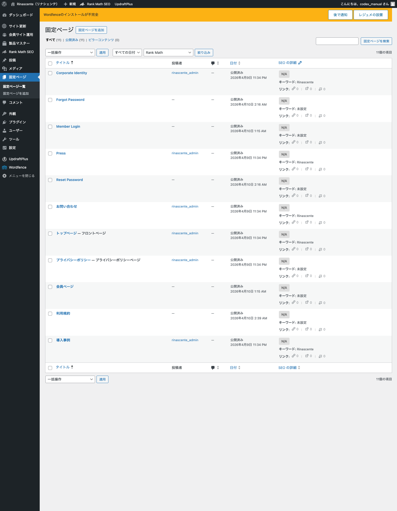

| 固定ページ | 本文編集が反映されるか | 更新方法 |
|---|---|---|
| プライバシーポリシー | 反映される | 本文を編集 |
| 利用規約 | 反映される | 本文を編集 |
| Press | 反映しない | `ニュース` 投稿で更新 |
| Corporate Identity | 一部のみ | `会社概要` 更新 + テンプレート |
| トップページ / お問い合わせ | 基本反映しない | テンプレートまたは別機能 |

#### 法務ページ編集

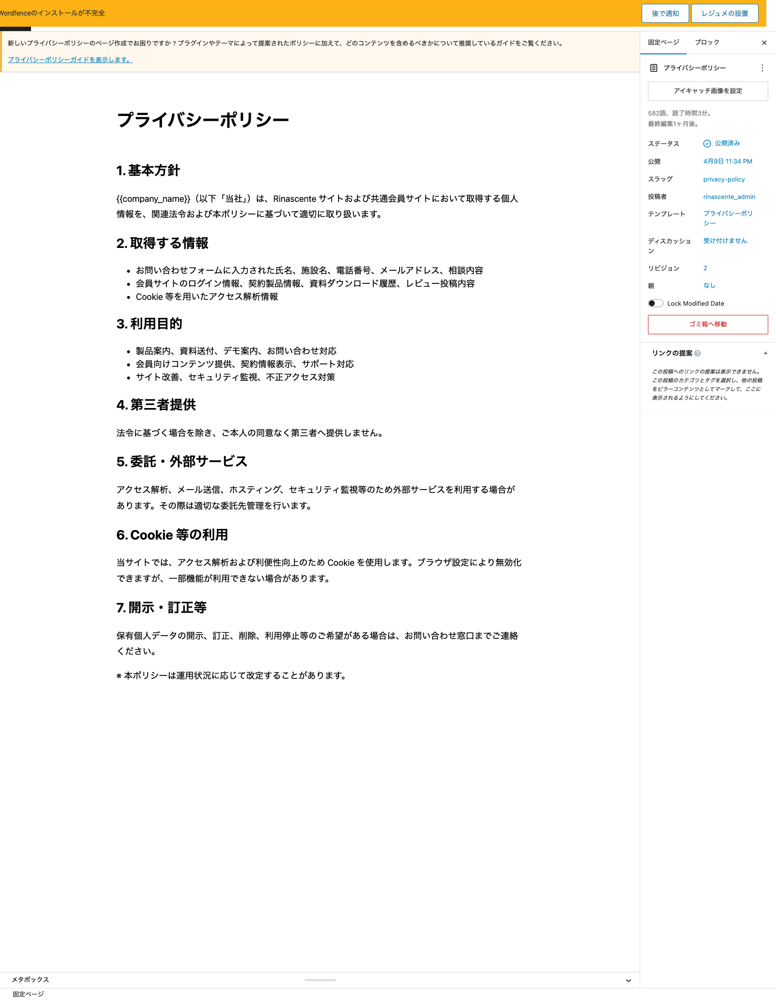

1. `固定ページ` から対象ページを開きます。
2. 本文ブロックを修正します。
3. `更新` を押します。

### 5.12 テーマカスタマイザーの更新

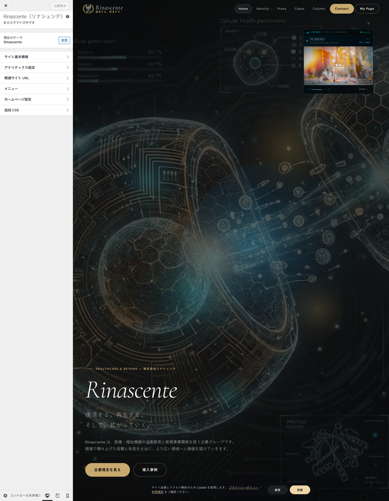

この画面は**サイト全体に影響する設定画面**です。通常運用では頻繁に触らず、変更目的がはっきりしているときだけ更新します。

1. 左メニューの `外観 > カスタマイズ` を開きます。
2. 左側メニューから対象セクションを選びます。
3. 値を更新します。
4. `公開` を押します。

#### Rinascente で変更できる主な項目

| セクション | 項目 |
|---|---|
| アナリティクス設定 | GA4 測定ID |
| アナリティクス設定 | GTM コンテナID |
| アナリティクス設定 | Slack Webhook URL |
| 関連サイト URL | YUMEHO サイト URL |
| 関連サイト URL | MICA30 サイト URL（有効時のみ） |
| 関連サイト URL | Basic認証 ID / PW |

#### YUMEHO で変更できる主な項目

| セクション | 項目 |
|---|---|
| アナリティクス設定 | GA4 Measurement ID |
| アナリティクス設定 | GTM Container ID |
| アナリティクス設定 | Slack Webhook URL |
| アナリティクス設定 または 導入拠点マップ設定 | Google Maps API Key |
| 関連サイト URL | コーポレートサイト URL |
| 関連サイト URL | Basic認証 ID / PW |

## 6. 固定ページを編集するときの判断ルール

固定ページを開いて本文が編集できても、**その本文が公開画面に使われていない** ページがあります。  
迷ったら、次のルールで判断してください。

1. 法務ページなら、ほぼ固定ページ本文を編集します。
2. ニュース / コラム / FAQ / 導入事例 / 導入拠点のような一覧ものは、固定ページ本文ではなく各投稿一覧側を更新します。
3. 会社情報・価格・会員情報は、固定ページ本文ではなく専用管理画面を更新します。
4. ページの構造そのものを変えたい場合は、CMSではなく開発対応です。

## 7. 公開前チェックリスト

### 7.1 投稿系更新の共通チェック

1. タイトルが入っているか。
2. 一覧説明文または抜粋が必要な画面で入っているか。
3. 代表画像が必要な更新で設定されているか。
4. カテゴリが選ばれているか。
5. 公開日や公開状態が意図どおりか。

### 7.2 YUMEHO 価格・会社情報更新のチェック

1. 価格変更は YUMEHO 側ではなく Rinascente の `製品マスター` で更新したか。
2. 会社情報変更は Rinascente の `会社概要` で更新したか。
3. 反映待ちの可能性がある場合、最大15分ほど待って再確認したか。

### 7.3 会員向け更新のチェック

1. 対象製品が `共通` でよいか確認したか。
2. 期間限定公開なら開始日 / 終了日を設定したか。
3. 動画は YouTube ID が正しいか。
4. 資料は正しいファイルを選択したか。
5. サポート情報は `表示タイプ` が適切か。

## 8. よくある迷いどころ

### 8.1 YUMEHO の会社概要を直したい

`YUMEHO > 固定ページ > 会社概要` ではなく、**`Rinascente > 会社概要`** を更新します。

### 8.2 YUMEHO の価格を変えたい

`YUMEHO > 価格参照` は確認画面です。  
実際の更新先は **`Rinascente > 会員サイト運用 > 製品マスター`** です。

### 8.3 FAQページに見出し文を追加したい

FAQそのものは `FAQ` 投稿で更新し、ページ上部の導入文は **`YUMEHO > 固定ページ > FAQ`** で更新します。

### 8.4 会員向けコンテンツを YUMEHO 側で探してしまう

現在の運用では、会員限定動画・資料・サポート情報は **Rinascente 側** の `会員サイト運用` で更新します。

### 8.5 固定ページを編集したのに公開画面が変わらない

そのページはテンプレート固定の可能性が高いです。  
このマニュアルの `2. 公開ページごとの更新元マップ` を確認し、正しい更新元へ戻ってください。

## 9. CMSで変更できない項目を開発者へ依頼するとき

次のような依頼は、WordPress 管理画面ではなく開発対応です。

1. ページのレイアウト自体を変えたい。
2. CTA ボタンやブロック構成を追加したい。
3. フォーム仕様を変えたい。
4. テキストではなく、ページの表示ロジックを変えたい。
5. 固定ページ本文が反映されないテンプレートページを変更したい。

## 10. 開発依頼時に共有するとよい情報

1. どの公開ページを変えたいか。
2. CMSで触ったが反映しなかったかどうか。
3. 変更したい内容が `文言` なのか `構造` なのか。
4. スマホ / PC のどちらで見た変化か。
5. 変更希望箇所のスクリーンショット。

---

必要な更新先が分からなくなった場合は、**「固定ページ本文を直す前に、このマニュアルの早見表を見る」** を基本ルールにしてください。  
特に **YUMEHO の会社概要・価格・会員情報** は、更新元が別画面になっています。
